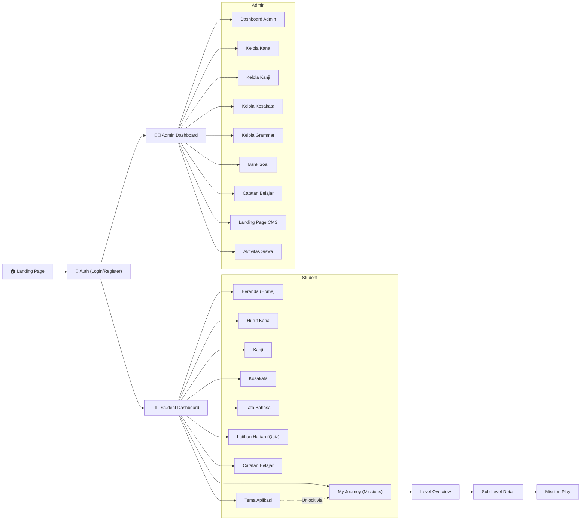

# 📖 Benkyou — Dokumentasi Sistem Lengkap

> **Tujuan dokumen ini:** Menjadi referensi utama untuk UI/UX overhaul seluruh sistem Benkyou.
> Mencakup **Landing Page**, **Dashboard Student**, dan **Dashboard Sensei (Admin)** secara menyeluruh.

---

## 📐 Arsitektur & Stack Teknis

| Layer | Teknologi |
|---|---|
| Backend | Laravel 10+ (PHP) |
| Frontend | React (TSX/JSX) via Inertia.js |
| Routing | Server-side (Laravel) + Inertia client-side |
| Styling | Tailwind CSS + CSS Custom Properties (theming) |
| Animasi | Framer Motion (`motion/react`) |
| Icons | Lucide React |
| Build | Vite |
| Database | MySQL (via Eloquent ORM) |

### Sistem Layout

Semua halaman (kecuali Landing Page & Auth) dibungkus oleh `Layout.tsx`:
- **Sidebar** (kiri) — navigasi utama, tersembunyi di mobile, muncul via hamburger menu
- **Main Content** (kanan) — scrollable area
- **Mobile Header** — bar atas dengan branding + hamburger toggle
- Responsive breakpoints: `sm:640px`, `md:768px`, `lg:1024px`, `xl:1280px`

---

## 🎨 Palet Warna & Design Tokens (Landing Page)

Palet warna ini menjadi acuan konsistensi visual:

| Token | Nilai Default | Keterangan |
|---|---|---|
| `--color-washi` | `#F5F2EB` | Background utama (warna kertas Jepang) |
| `--color-ink` | `#1C1C1C` | Teks utama (gelap) |
| `--color-ink-light` | `#4A4A4A` | Teks sekunder |
| `--color-japan-red` | `#BE0029` | Aksen utama (merah Jepang) |
| `--color-sakura` | `#FFB7C5` | Aksen pink sakura |
| `--color-matcha` | `#C5E1A5` | Aksen hijau matcha |
| `--color-sakura-dark` | _(derived)_ | Sakura gelap untuk contrast |
| `--color-matcha-dark` | _(derived)_ | Matcha gelap untuk contrast |

### Fonts
- **Serif**: Font serif untuk heading/judul
- **Fredoka**: Font playful untuk heading hero/display
- **JP (font-jp)**: Font Jepang untuk karakter kanji/kana
- **Sans-serif default**: Body text

---

## 🏠 1. Landing Page (`Welcome.jsx`)

> **File:** [`Welcome.jsx`](file:///d:/Benkyou/Benkyou/resources/js/Pages/Welcome.jsx)
> **Route:** `/` (root)
> **Ukuran:** ~1470 baris, file terbesar di project

Landing Page adalah halaman publik yang tampil sebelum login. Kontennya **dinamis** — sebagian besar teks & gambar dikelola via `LandingSetting` model oleh Admin.

### 1.1 Navbar / Header
- **Logo:** Karakter Jepang `日` + brand name "Benkyou"
- **Subtitle:** Configurable via `site_logo_sub`
- **Navigation Links:** 5 link configurable (`nav_link1` – `nav_link5`)
- **Announcement Bar:** Teks pengumuman di bagian paling atas (configurable via `announcement_text`)
- **Auth Buttons:** Tombol "Masuk" dan "Daftar" (muncul jika user belum login)

### 1.2 Hero Section (Selalu tampil)
Hero utama yang menjadi first impression. Isinya:

| Elemen | Key Setting | Deskripsi |
|---|---|---|
| Badge | `hero_badge` | Label kecil di atas judul (e.g. "Gratis & Interaktif") |
| Title | `hero_title` | Judul besar utama |
| Subtitle | `hero_subtitle` | Deskripsi pendek di bawah judul |
| CTA Button | `hero_cta_text` | Tombol aksi utama ("Mulai Belajar Sekarang") |
| Hero Image | `hero_image` | Gambar utama (URL) |
| Stat Badge | `hero_stat_badge` + `hero_stat_label` | Badge statistik floating |
| Info Badge | `hero_info_badge` | Badge info tambahan |
| Documentation Link | `hero_doc_text`, `hero_doc_link`, `hero_doc_link_text` | Link ke dokumentasi |
| Video Button | `hero_video_btn_text`, `hero_video_url`, `hero_video_label`, `hero_video_duration` | Tombol play video pengenalan |

- **Background:** Gradient `from-[#FDFBF7] via-[#f7f4ed] to-[#F1EDE2]`
- **Min Height:** `calc(100dvh - 5.5rem)` — full viewport

### 1.3 Section: Program Belajar (`section_program_visible`)
Menampilkan **3 tab jalur belajar** (Pemula, Menengah, Mahir):

| Tab | Key Prefix | Rank |
|---|---|---|
| Pemula | `tab1_*` | Kohai 🌱 |
| Menengah | `tab2_*` | Senpai ⚡ |
| Mahir | `tab3_*` | Samurai 🏯 |

Setiap tab memiliki: `name`, `title`, `subtitle`, `desc1`, `desc2`, `badge`, `stats`, `image`

- Header section: `program_title`, `program_subtitle`
- CTA di bawah tab: `tab_cta_text`, `tab_cta_sub`

### 1.4 Section: Modul Pembelajaran (`section_modul_visible`)
Menampilkan card-card **fitur utama platform**:

| Modul | Icon | Deskripsi |
|---|---|---|
| Huruf Kana | PenTool | Hiragana & Katakana interaktif |
| Kanji | Languages | Kamus Kanji dengan filter level |
| Kosakata | BookOpen | Flashcard kosakata |
| Tata Bahasa | GraduationCap | Pola kalimat accordion |

Setiap card memiliki: `modul{N}_title`, `modul{N}_desc`, icon hardcoded

### 1.5 Section: Metode Belajar (`section_method_visible`)
Menjelaskan **4 aspek metode** yang digunakan platform:

| Aspek | Key Prefix | Contoh |
|---|---|---|
| Aspek 1 | `method1_*` | Visual & Audio Interaktif |
| Aspek 2 | `method2_*` | Gamifikasi & Tantangan |
| Aspek 3 | `method3_*` | Progres Terstruktur |
| Aspek 4 | `method4_*` | Catatan Personal |

Setiap aspek: `title`, `desc`, `detail`, `icon`

### 1.6 Section: Testimoni (`section_testi_visible`)
**Carousel** testimoni pengguna:
- Navigasi dot/bullet pagination
- Auto-rotate (configurable)
- Setiap testimoni: `testi{N}_name`, `testi{N}_role`, `testi{N}_text`, `testi{N}_avatar`

### 1.7 Section: Berita/Catatan Kecil (`section_berita_visible`)
- Menampilkan **catatan dari admin** yang ditulis untuk student
- Data diambil dari `UserNote` model (note yang memiliki `author_id`)
- Max 4 catatan terbaru
- Setiap catatan menampilkan: title, content, date

### 1.8 Section: CTA Final (`section_cta_visible`)
- Call to Action terakhir sebelum footer
- Tombol besar "Mulai Belajar"
- Motivational text

### 1.9 Footer
- Informasi platform
- Copyright
- Social links (if any)

### 1.10 Fitur Tambahan Landing Page
- **Scroll-to-Top Button:** Muncul saat scroll > 400px
- **Video Modal:** Modal popup untuk video pengenalan (`hero_video_url`)
- **Responsive:** Full mobile/tablet/desktop support
- **Animasi:** Scroll-triggered animations via Framer Motion

---

## 👩‍🎓 2. Dashboard Student

> **Route Prefix:** `/student/*`
> **Layout:** `Layout.tsx` dengan Sidebar Student (tema terang/light)
> **Middleware:** `auth`

### 2.0 Sidebar Navigasi Student

| Menu | Label | Icon | Route |
|---|---|---|---|
| Beranda | Beranda | `Home` | `/student/home` |
| Kana | Kana | `PenTool` | `/student/kana` |
| Kanji | Kanji | `Languages` | `/student/kanji` |
| Kosakata | Kosakata | `List` | `/student/vocabulary` |
| Tata Bahasa | Tata Bahasa | `BookOpen` | `/student/grammar` |
| Latihan Harian | Latihan Harian | `CheckCircle` | `/student/quiz` |
| My Journey | My Journey | `GraduationCap` | `/student/missions` |
| Catatan Belajar | Catatan Belajar | `Mail` | `/student/notes` |
| Tema Aplikasi | Tema Aplikasi | `Palette` | `/student/themes` |

**Footer Sidebar:**
- Nama user + email
- Tombol "Dashboard Admin" (hanya muncul jika user role = admin)
- Tombol "Keluar" (logout)
- Jika belum login: tombol "Masuk" + "Daftar"

---

### 2.1 Beranda Student (`Home.tsx`)

> **File:** [`Home.tsx`](file:///d:/Benkyou/Benkyou/resources/js/Pages/Student/Home.tsx)
> **Route:** `/student/home`

**Konten:**

#### 2.1.1 Welcome Hero Banner
- Greeting personal: "Hai, **{nama user}** ✨"
- Subtitle motivasi
- Decorative kanji watermarks (`日本`, `語`)
- **Quick Stats** (2 cards):
  - 🔥 **Hari Belajar (Streak):** Dihitung dari `UserActivity` + `UserQuiz` — berapa hari berturut-turut user aktif
  - ⭐ **Misi Tuntas:** Jumlah `UserCertification` yang `passed = true`

#### 2.1.2 Feature Grid ("Pilih Materi Belajar")
7 kartu navigasi ke fitur utama:

| Kartu | Warna Gradient | JP Char | Deskripsi |
|---|---|---|---|
| Huruf Kana | Rose/Red | あ | "Hiragana & Katakana — fondasi pertama" |
| Kanji | Amber/Orange | 漢 | "Karakter cantik yang bikin kamu kelihatan keren" |
| Kosakata | Emerald/Teal | — | "Kata-kata yang sering muncul di anime & J-Pop" |
| Tata Bahasa | Blue/Indigo | — | "Racik kalimatmu sendiri" |
| Latihan Seru | Purple/Violet | — | "Kuis acak setiap sesi" |
| My Journey | Rose/Pink | — | "Dari Kohai sampai Shogun" |
| Catatan Belajar | Teal/Cyan | — | "Jurnal pribadi untuk menulis catatan" |

Setiap kartu: icon, gradient hover, "Mulai →" link

#### 2.1.3 Kata Hari Ini
- Kanji besar: `桜` (sakura)
- Romaji: `sakura`
- Arti: `bunga sakura 🌸`
- CTA: "Lihat Lebih Banyak Kata →" → link ke `/student/vocabulary`
- Background gelap dengan decorative watermark

---

### 2.2 Huruf Kana (`Kana.tsx`)

> **File:** [`Kana.tsx`](file:///d:/Benkyou/Benkyou/resources/js/Pages/Student/Kana.tsx)
> **Route:** `/student/kana`
> **Data:** `kanaData` dari `KanaController`

**Konten & Fitur:**

#### 2.2.1 Hero Header
- Badge: "Huruf Kana"
- Judul dinamis: "Tabel Hiragana" atau "Tabel Katakana"
- Deskripsi edukatif sesuai tab
- **Tab Switcher:** Toggle Hiragana ↔ Katakana (grid 2 kolom)
- Warna dinamis: Hiragana = rose/red, Katakana = blue/indigo

#### 2.2.2 Tips Box
- Penjelasan tentang huruf yi, ye, wi, wu, we yang sudah tidak digunakan
- Instruksi: "Klik kartu untuk mendengar pengucapannya!"

#### 2.2.3 Grid Kartu Kana
3 sub-section per tab:

| Sub-section | Label Jepang | Jumlah Grid |
|---|---|---|
| Bentuk Dasar | Gojūon (五十音) | 5×10 / 10×5 |
| Dakuten & Handakuten | 濁点・半濁点 | 5×N |
| Huruf Gabungan | Yōon (拗音) | 3×N |

**Interaksi per kartu:**
- Hover: scale up + warna border berubah + muncul icon speaker
- Click: **Text-to-Speech** — Web Speech API baca huruf dalam bahasa Jepang
- Empty cell: dashed border, opacity rendah (huruf yang sudah tidak digunakan)
- Setiap kartu menampilkan: karakter kana + romaji

---

### 2.3 Kanji (`Kanji.tsx`)

> **File:** [`Kanji.tsx`](file:///d:/Benkyou/Benkyou/resources/js/Pages/Student/Kanji.tsx)
> **Route:** `/student/kanji`
> **Data:** `kanjiData` dari `KanjiController`

**Konten & Fitur:**

#### 2.3.1 Header Banner
- Badge: "Kamus Kanji"
- Judul: "Karakter Bahasa Jepang ✍️"
- Watermark: `漢字`
- Instruksi klik untuk dengar

#### 2.3.2 Filter & Search Bar
- **Search:** Input pencarian kanji, romaji, atau arti
- **Level Filter Pills:** Tombol filter `Semua | N5 | N4 | N3 | N2 | N1`
  - Setiap level punya warna badge berbeda:
    - N5: Emerald, N4: Blue, N3: Amber, N2: Purple, N1: Rose
- Auto-reset halaman ke 1 saat filter berubah

#### 2.3.3 Grid Kartu Kanji
- Grid: `2 col (mobile) → 3 col (sm) → 4 col (md) → 5 col (lg)`
- Setiap kartu menampilkan:
  - **Level badge** (pojok kanan atas, warna sesuai level)
  - **Speaker icon** (pojok kiri atas, hover → merah)
  - **Karakter Kanji** (besar, tengah)
  - **Romaji** (merah)
  - **Arti** (uppercase, abu-abu)
- Click: **Text-to-Speech** dengan konversi Romaji → Hiragana → Speech
  - Konversi table lengkap (80+ mapping romaji → hiragana)
  - Support double consonant (っ)

#### 2.3.4 Pagination
- 20 item per halaman
- Navigasi: "Sebelumnya | 1 2 ... | Berikutnya"
- Ellipsis pagination cerdas (max 7 buttons)
- Info: "Menampilkan X - Y dari Z hasil"

---

### 2.4 Kosakata (`Vocabulary.tsx`)

> **File:** [`Vocabulary.tsx`](file:///d:/Benkyou/Benkyou/resources/js/Pages/Student/Vocabulary.tsx)
> **Route:** `/student/vocabulary`
> **Data:** `vocabularyData` dari `VocabularyController`

**Konten & Fitur:**

#### 2.4.1 Header Banner
- Badge: "Kartu Pintar"
- Judul: "Kosakata Jepang 📖"
- Progress counter: `{current}/{total}` kata
- **Progress Bar** animasi (persentase kata yang sudah dilihat)
- Warna: Matcha/Teal gradient

#### 2.4.2 Flashcard Interaktif
- **Flip Card** (front/back):
  - **Front:** Kata Jepang besar + type badge (noun/verb/adjective/etc) + tombol speaker
  - **Back:** Arti dalam Bahasa Indonesia + romaji
- Animasi 3D flip (rotateX) via Framer Motion
- Click untuk flip bolak-balik

#### 2.4.3 Kontrol Navigasi
- **Tombol Sebelum** (← ChevronLeft)
- **Tombol Reset** (kembali ke kartu pertama)
- **Tombol Lanjut** (ChevronRight →)
- **Dot Navigation** — setiap kata punya dot, bisa klik langsung

#### 2.4.4 Type Colors (Badge Jenis Kata)

| Type | Background | Text |
|---|---|---|
| Noun | Blue-100 | Blue-700 |
| Verb | Emerald-100 | Emerald-700 |
| Adjective | Amber-100 | Amber-700 |
| Adverb | Purple-100 | Purple-700 |
| Particle | Rose-100 | Rose-700 |
| Expression | Orange-100 | Orange-700 |

---

### 2.5 Tata Bahasa (`Grammar.tsx`)

> **File:** [`Grammar.tsx`](file:///d:/Benkyou/Benkyou/resources/js/Pages/Student/Grammar.tsx)
> **Route:** `/student/grammar`
> **Data:** `grammarData` dari `GrammarController`

**Konten & Fitur:**

#### 2.5.1 Header Banner
- Badge: "Pelajaran"
- Judul: "Tata Bahasa Jepang 📝"
- Counter: jumlah pola grammar
- Watermark: `文法`
- Warna: Blue/Indigo gradient

#### 2.5.2 Grammar Accordion
Setiap pola bahasa ditampilkan sebagai **accordion card**:
- **Header (collapsed):**
  - Number badge (01, 02, ...)
  - Judul pola
  - Deskripsi singkat
  - Chevron up/down toggle
- **Body (expanded):**
  - Deskripsi lengkap (border-left blue accent)
  - **Contoh Kalimat** (per pola bisa multiple):
    - Kalimat Jepang (font-jp besar)
    - Romaji (italic, biru)
    - Terjemahan Indonesia
    - Tombol speaker 🔊 → Text-to-Speech kalimat Jepang
  - **Catatan** (Notes) — tip box kuning amber dengan icon Lightbulb

---

### 2.6 Latihan Harian / Quiz (`Quiz.tsx`)

> **File:** [`Quiz.tsx`](file:///d:/Benkyou/Benkyou/resources/js/Pages/Student/Quiz.tsx)
> **Route:** `/student/quiz`
> **Data:** `questionsData` (type = 'quiz') dari DB **ATAU** auto-generated dari data lokal

**Konten & Fitur:**

#### 2.6.1 Header
- Judul: "Latihan Tanpa Batas"
- Deskripsi: "Setiap sesi mengacak 10 pertanyaan dari Kosakata, Kanji, dan Tata Bahasa"

#### 2.6.2 Sumber Soal (Dual Source)
1. **Database Questions** — jika ada `questionsData` dari backend, gunakan itu
2. **Auto-Generated** — jika DB kosong, generate dari data lokal:
   - 4 soal Vocabulary (tanya arti kata)
   - 3 soal Kanji (tanya arti kanji)
   - 3 soal Grammar (translate kalimat)

#### 2.6.3 Quiz Flow
1. **Soal ditampilkan satu per satu** dalam card besar
2. **Info bar:** badge kategori + counter `{current}/{total}`
3. **4 pilihan jawaban** (multiple choice, options di-shuffle tiap sesi)
4. **Feedback instant:**
   - Benar: border hijau + ✅ icon
   - Salah: border merah + ❌ icon, jawaban benar tetap ditampilkan hijau
5. **Tombol "Soal Berikutnya"** atau **"Selesaikan"** di soal terakhir

#### 2.6.4 Hasil Akhir
- Skor: `{benar} / {total}`
- Pesan motivasi
- Tombol "Latihan Baru" → generate soal baru
- **Activity Logging:** POST ke `/student/quiz/log` saat selesai (score, total, category)

---

### 2.7 My Journey / Missions (`Missions.tsx`, `MissionLevel.tsx`, `MissionPlay.tsx`)

> **Files:**
> - [`Missions.tsx`](file:///d:/Benkyou/Benkyou/resources/js/Pages/Student/Missions.tsx) — Halaman utama daftar level
> - [`MissionLevel.tsx`](file:///d:/Benkyou/Benkyou/resources/js/Pages/Student/MissionLevel.tsx) — Detail sub-level per level
> - [`MissionPlay.tsx`](file:///d:/Benkyou/Benkyou/resources/js/Pages/Student/MissionPlay.tsx) — Gameplay misi

Sistem **gamifikasi** utama platform — "perjalanan" dari Kohai ke Shogun.

#### 2.7.1 Halaman Missions (Daftar Level)

**Hero Header:**
- Icon Trophy + badge "Perjalanan Ajaib"
- Judul: "My Journey ✨"
- Deskripsi: progres menuju gelar Shogun
- **Progress Ring** (SVG circular) — `{passedCount}/{totalCount}` level selesai + persentase
- Watermark: `旅` `道`

**Level Cards** — setiap level adalah card besar:

| Level | Rank | Icon | Warna |
|---|---|---|---|
| 1 (N5) | Kohai | ScrollText | Emerald |
| 2 (N4) | Senpai | Star | Blue |
| 3 (N3) | Samurai | Sword | Orange |
| 4 (N2) | Shogun | Crown | Rose/Red |

Setiap card menampilkan:
- Level badge + Rank badge
- Status: "Tuntas" ✅ / "Terkunci" 🔒
- Judul level + subtitle
- Meta info: Goal, jumlah tantangan, skor, reward
- **Score Bar** — progress bar horizontal dengan warna dinamis (merah < 50%, kuning 50-79%, hijau ≥ 80%)
- CTA: "Mulai Tantangan" (belum tuntas) atau "Main Lagi" (sudah tuntas)

**Rank Legend** — 4 kartu kecil menjelaskan jalur gelar

**Sistem Unlock:** Level harus diselesaikan berurutan (level N harus `passed` sebelum level N+1 terbuka)

#### 2.7.2 Halaman MissionLevel (Sub-Level Detail)

Setiap level punya **multiple sub-levels (tahap)**:
- **Story Banner** — cerita fiksi setiap level:
  - Level 1: "Lapar di Tokyo" 🍣 (Haneda)
  - Level 2: "Tersesat di Kyoto" ⛩️ (Fushimi)
  - Level 3: "Magang di Kafe Buku Shibuya" ☕
  - Level 4: "Festival Musim Panas Osaka" 🎆 (Dotonbori)
  - Level 5: "Penaklukan Gunung Fuji" 🗻
- Location badges, JLPT level badges
- Progress: `{completed}/{total}` tahap selesai

**Sub-Level Grid** (2 kolom):
- Step badge + nomor tahap
- Status: Tuntas (score %) / Terkunci
- Jumlah tantangan
- CTA: "Mulai Tahap Ini" / "Ulangi Tahap"
- **Confirm Modal** — saat ulangi tahap, muncul popup konfirmasi

#### 2.7.3 Halaman MissionPlay (Gameplay)

File terbesar ke-2 (~768 baris). Jenis soal yang didukung:

| Tipe Soal | `question_type` | Deskripsi |
|---|---|---|
| Multiple Choice | `multiple-choice` | Pilih jawaban dari 4 opsi |
| Typing | `typing` | Ketik jawaban manual |
| Listening | `listening` | Dengarkan audio → jawab |
| Reading | `reading` | Baca konteks → jawab |
| Image-based | `image` | Lihat gambar → jawab |
| Essay | `essay` | Tulis jawaban panjang (AI grading) |

**Fitur MissionPlay:**
- Text-to-Speech dengan voice selection Jepang (async voice loading)
- Answer validation: normalize case, trim, support multiple correct answers (comma-separated & array)
- Navigasi: chevron prev/next antar soal
- Skor dihitung per soal
- Submit skor ke backend: POST `/student/missions/{level}/{subLevel}/submit`
- Essay grading: POST `/student/missions/essay/{question}/grade`

---

### 2.8 Certification (`Certification.tsx`)

> **File:** [`Certification.tsx`](file:///d:/Benkyou/Benkyou/resources/js/Pages/Student/Certification.tsx)
> **Route:** `/student/certification`
> **Data:** `questionsData` (type = n1-n5) dari DB

> [!NOTE]
> Certification page ini **TIDAK muncul di sidebar navigasi student** — kemungkinan diakses via menu lain atau direct link. Perlu dicek apakah akan disertakan di redesign.

**Konten:**
- Daftar kategori sertifikasi (N5, N4, N3, N2, N1)
- Setiap kategori punya multiple levels
- Sama seperti MissionPlay tapi fokus pada sertifikasi resmi JLPT
- Support semua tipe soal (multiple-choice, typing, listening, reading, image, essay)

---

### 2.9 Catatan Belajar (`Notes.tsx`)

> **File:** [`Notes.tsx`](file:///d:/Benkyou/Benkyou/resources/js/Pages/Student/Notes.tsx)
> **Route:** `/student/notes`

**Konten & Fitur:**

#### 2.9.1 Header
- Icon Mail + "Catatan Kecilku"
- Deskripsi: "Ruang rahasiamu untuk menulis ide, pengingat, atau cerita belajarmu"
- Tombol "+ Tulis Catatan Baru"

#### 2.9.2 Daftar Catatan
- Loading state: spinner animasi
- Empty state: icon FileText + pesan motivasi
- Setiap catatan ditampilkan sebagai **letter-style card**:
  - Header: tanggal (badge merah) + tombol Edit & Delete
  - Body: judul (opsional) + konten (whitespace-pre-wrap)
  - Gradient header: `from-[#fff9f9] to-white`

#### 2.9.3 CRUD Operations
- **Create:** Modal form (title opsional + content required)
- **Edit:** Modal form sama, pre-filled data
- **Delete:** Confirm dialog native browser
- **API Endpoints:**
  - GET `/student/notes/api` — list semua notes
  - POST `/student/notes/api` — buat note baru
  - PUT `/student/notes/api/{id}` — update note
  - DELETE `/student/notes/api/{id}` — hapus note

#### 2.9.4 Toast Notification
- Fixed position top center
- Animasi slide-in + scale
- Icon heart merah + pesan sukses
- Auto-dismiss setelah 3 detik

---

### 2.10 Tema Aplikasi (`Themes.tsx`)

> **File:** [`Themes.tsx`](file:///d:/Benkyou/Benkyou/resources/js/Pages/Student/Themes.tsx)
> **Route:** `/student/themes`

**Konten & Fitur:**

#### 2.10.1 Header
- Icon Palette + "Tema Aplikasi"
- Deskripsi: "Sesuaikan tampilan dengan tema dari menyelesaikan tantangan"

#### 2.10.2 Tema Tersedia (6 tema total)

| Tema ID | Nama | Unlock Condition | Palet Utama |
|---|---|---|---|
| `default` | Original (Klasik) | Tersedia sejak awal | Washi/Red/Sakura |
| `sakura` | Mekar Sakura (N5) | Selesaikan Level Kohai | Pink/Rose |
| `matcha` | Hijau Matcha (N4) | Selesaikan Level Senpai | Green/Lime |
| `fuji` | Gunung Fuji (N3) | Selesaikan Level Sensei | Blue/Indigo |
| `autumn` | Musim Gugur (N2) | Selesaikan Level Tensai | Orange/Brown |
| `midnight` | Malam Tokyo (N1) | Selesaikan Level Shogun | Dark/Purple (dark mode!) |

#### 2.10.3 Mekanisme Tema
- Tema mengubah **6 CSS custom properties** secara real-time via `document.documentElement.style`
- Disimpan ke backend: POST `/student/preferences` → `UserPreference.theme_id`
- Admin otomatis unlock semua tema
- Student: unlock berdasarkan `UserCertification` (kategori n5-n1, passed = true)
- Tema di-apply saat halaman load dari database

#### 2.10.4 UI Tema Grid
- Grid: `1 col (mobile) → 2 col (sm) → 3 col (md)`
- Setiap tema card:
  - Icon box berwarna sesuai `--color-japan-red` tema
  - Cat icon (aktif/inactive opacity)
  - Nama tema + lock icon (jika terkunci)
  - Unlock hint text
  - Border aktif: `border-[var(--color-japan-red)]`

---

## 👨‍🏫 3. Dashboard Admin / Sensei

> **Route Prefix:** `/admin/*`
> **Layout:** `Layout.tsx` dengan Sidebar Admin (tema gelap/dark)
> **Middleware:** `auth`
> **Background:** `#f1f5f9` (Slate-100)

### 3.0 Sidebar Navigasi Admin

**Grup: Ikhtisar**

| Menu | Label | Icon | Route |
|---|---|---|---|
| Dashboard | Dashboard Admin | `LayoutDashboard` | `/admin` |

**Grup: Kelola Konten**

| Menu | Label | Icon | Route |
|---|---|---|---|
| Kana | Huruf Kana | `PenTool` | `/admin/kana` |
| Kanji | Karakter Kanji | `Languages` | `/admin/kanji` |
| Vocabulary | Kosakata | `List` | `/admin/vocabulary` |
| Grammar | Tata Bahasa | `BookOpen` | `/admin/grammar` |
| Question | Bank Soal | `CheckCircle` | `/admin/question` |
| Notes | Catatan Belajar | `Mail` | `/admin/notes` |
| Landing | Landing Page | `LayoutTemplate` | `/admin/landing` |
| Activity | Aktivitas Siswa | `Activity` | `/admin/activity` |

**Sidebar Styling:**
- Dark gradient: `from-#0f172a to-#1e1b4b`
- Active item: `bg-white/15` + red icon glow
- User footer: avatar initials + email + logout
- Badge: "Administrator Sensei"

---

### 3.1 Dashboard Admin (`Admin/Dashboard.tsx`)

> **File:** [`Dashboard.tsx`](file:///d:/Benkyou/Benkyou/resources/js/Pages/Admin/Dashboard.tsx)
> **Route:** `/admin`

**Konten & Fitur:**

#### 3.1.1 Page Header
- Judul: "Pusat Administrator"
- Subtitle: "Kelola materi & pantau progres belajar"
- Badge: "Administrator Sensei"

#### 3.1.2 Stats Cards (4 kartu)

| Stat | Icon | Gradient |
|---|---|---|
| Total Pelajar | Users | Blue → Indigo |
| Kuis Dikerjakan | CheckCircle | Green → Emerald |
| Pencapaian Diraih | Award | Purple → Violet |
| Catatan Ditulis | Book | Amber → Red |

#### 3.1.3 Quick Links (5 shortcut)
- Tambah Kana, Tambah Kanji, Tambah Kosakata, Tambah Grammar, Tambah Soal
- Setiap link punya warna accent berbeda

#### 3.1.4 Tabel Users
- **Search bar** — cari berdasarkan nama/email
- **Tabel data:**
  - Avatar (initials + gradient color)
  - Nama, Email, Role
  - Jumlah Kuis, Notes, Sertifikasi
  - Tanggal daftar
  - Tombol "Lihat Detail" (Eye icon)
- **Pagination:** 10 per halaman
- **Empty state** jika tidak ada user

#### 3.1.5 User Detail Modal
Modal popup saat klik "Lihat Detail":
- 3 tab: **Kuis** | **Catatan** | **Sertifikasi**
- Tab Kuis: list semua kuis (skor, total, kategori, tanggal)
- Tab Catatan: list semua notes (tanggal, konten)
- Tab Sertifikasi: list semua pencapaian (kategori, level, status passed, skor)

---

### 3.2 Kelola Huruf Kana (`Admin/ManageKana.tsx`)

> **File:** [`ManageKana.tsx`](file:///d:/Benkyou/Benkyou/resources/js/Pages/Admin/ManageKana.tsx)
> **Route:** `/admin/kana`

**Fitur CRUD:**
- **Tambah:** kategori (hiragana/katakana/dakuten/yoon/etc), romaji, karakter kana
- **Edit:** update data existing
- **Hapus:** delete dengan konfirmasi
- **API:** POST/PUT/DELETE ke `/admin/kana`

---

### 3.3 Kelola Karakter Kanji (`Admin/ManageKanji.tsx`)

> **File:** [`ManageKanji.tsx`](file:///d:/Benkyou/Benkyou/resources/js/Pages/Admin/ManageKanji.tsx)
> **Route:** `/admin/kanji`

**Fitur CRUD:**
- **Tambah:** karakter kanji, romaji, meaning, level (N5-N1)
- **Edit:** update data existing
- **Hapus:** delete dengan konfirmasi
- **API:** POST/PUT/DELETE ke `/admin/kanji`

---

### 3.4 Kelola Kosakata (`Admin/ManageVocabulary.tsx`)

> **File:** [`ManageVocabulary.tsx`](file:///d:/Benkyou/Benkyou/resources/js/Pages/Admin/ManageVocabulary.tsx)
> **Route:** `/admin/vocabulary`

**Fitur CRUD:**
- **Tambah:** word, romaji, meaning, type (noun/verb/adjective/etc)
- **Edit:** update data existing
- **Hapus:** delete dengan konfirmasi
- **API:** POST/PUT/DELETE ke `/admin/vocabulary`

---

### 3.5 Kelola Tata Bahasa (`Admin/ManageGrammar.tsx`)

> **File:** [`ManageGrammar.tsx`](file:///d:/Benkyou/Benkyou/resources/js/Pages/Admin/ManageGrammar.tsx)
> **Route:** `/admin/grammar`

**Fitur CRUD:**
- **Tambah:** title, description, notes, examples (array of {jp, romaji, en})
- **Edit:** update data existing
- **Hapus:** delete dengan konfirmasi
- **API:** POST/PUT/DELETE ke `/admin/grammar`

---

### 3.6 Kelola Bank Soal (`Admin/ManageQuestion.tsx`)

> **File:** [`ManageQuestion.tsx`](file:///d:/Benkyou/Benkyou/resources/js/Pages/Admin/ManageQuestion.tsx)
> **Route:** `/admin/question`

Halaman paling kompleks di admin (~1059 baris).

**Fitur:**

#### 3.6.1 Filter & Search
- **Search bar** — cari soal
- **Filter Kategori:** Semua | Latihan Harian (quiz) | Level 1 Kohai (n5) | Level 2 Senpai (n4) | Level 3 Sensei (n3) | Level 4 Tensai (n2) | Level 5 Legend (n1)
- **Filter Tipe Soal:** Semua | Multiple Choice | Typing | Listening | Reading | Image | Essay

#### 3.6.2 CRUD Soal
- **Tambah Soal (Form lengkap):**
  - Type: quiz / n5 / n4 / n3 / n2 / n1
  - Question Type: multiple-choice / typing / listening / reading / image / essay
  - Question text
  - Options (array, untuk multiple-choice)
  - Answer (string atau array)
  - Explanation (opsional)
  - Context (untuk reading)
  - Spoken Text + Speech Lang (untuk listening)
  - Image URL (untuk image-based)
  - Level ID (sub-level assignment)
  - Extra Attributes: essay_keywords, essay_rubric (untuk essay)
- **Edit:** form sama, pre-filled
- **Hapus:** delete dengan konfirmasi
- **Pagination:** 20 per halaman

---

### 3.7 Kelola Catatan Belajar (`Admin/ManageNotes.tsx`)

> **File:** [`ManageNotes.tsx`](file:///d:/Benkyou/Benkyou/resources/js/Pages/Admin/ManageNotes.tsx)
> **Route:** `/admin/notes`

**Fitur:**
- Catatan dari admin untuk student (muncul di landing page section "Berita/Catatan")
- **CRUD:** Create, Read, Update, Delete
- Fields: title, content, date
- **API:** POST/PUT/DELETE ke `/admin/notes`

---

### 3.8 Kelola Landing Page (`Admin/ManageLanding.tsx`)

> **File:** [`ManageLanding.tsx`](file:///d:/Benkyou/Benkyou/resources/js/Pages/Admin/ManageLanding.tsx)
> **Route:** `/admin/landing`

**CMS Lengkap** untuk mengontrol seluruh konten Landing Page.

#### 3.8.1 Grup Setting yang Bisa Diedit

| Grup | Fields |
|---|---|
| **Logo & Navigation** | `announcement_text`, `site_logo_sub`, `site_title`, `site_meta_desc`, `site_brand_name`, `site_logo_char`, `nav_link1-5` |
| **Hero Section** | `hero_badge`, `hero_title`, `hero_subtitle`, `hero_cta_text`, `hero_image`, `hero_stat_badge`, `hero_stat_label`, `hero_info_badge`, `hero_doc_*`, `hero_video_*` |
| **Program Tabs** | `program_title`, `program_subtitle`, `tab_cta_text`, `tab_cta_sub`, `tab1_*` – `tab3_*` |
| **Modul Cards** | `modul1_*` – `modul4_*` |
| **Metode Belajar** | `method1_*` – `method4_*` |
| **Testimoni** | `testi1_*` – `testi3_*` |
| **Section Visibility Toggles** | `section_program_visible`, `section_modul_visible`, `section_method_visible`, `section_testi_visible`, `section_berita_visible`, `section_cta_visible` |

#### 3.8.2 Section Visibility
Admin bisa **toggle on/off** setiap section di landing page:
- Program Belajar
- Modul Pembelajaran
- Metode Belajar
- Testimoni
- Berita/Catatan
- CTA Final

---

### 3.9 Aktivitas Siswa (`Admin/Activity.tsx`)

> **File:** [`Activity.tsx`](file:///d:/Benkyou/Benkyou/resources/js/Pages/Admin/Activity.tsx)
> **Route:** `/admin/activity`

**Konten & Fitur:**

#### 3.9.1 Header
- Judul: "Aktivitas {nama siswa}"
- Subtitle: "Pantau aktivitas dan progres belajar siswa di platform ini"

#### 3.9.2 Stats Cards (6 kartu mini)

| Stat | Deskripsi |
|---|---|
| Total Aksi | Jumlah semua aktivitas |
| Aksi Hari Ini | Aktivitas pada hari ini |
| Kuis Selesai | Total kuis yang dikerjakan |
| Misi Selesai | Total misi yang diselesaikan |
| Login Count | Jumlah login |
| Hari Aktif | Jumlah hari aktif |

#### 3.9.3 Timeline Aktivitas
List kronologis aktivitas siswa:
- Setiap entry: icon kategori, action text, deskripsi, timestamp
- Kategori: quiz, mission, notes, learning, general
- Warna per kategori berbeda

---

## 🔐 4. Halaman Autentikasi

> **Route Prefix:** `/login`, `/register`, `/forgot-password`, etc.
> **Layout:** `GuestLayout`

### 4.1 Login (`Auth/Login.jsx`)
- Judul: "Selamat Datang Kembali"
- Form: Email + Password + Remember Me
- Link: "Lupa Password?" + "Daftar"
- Status message (success/error)
- Icon: LogIn

### 4.2 Register (`Auth/Register.jsx`)
- Form: Nama, Email, Password, Konfirmasi Password
- Link: "Sudah punya akun? Masuk"

### 4.3 Forgot Password (`Auth/ForgotPassword.jsx`)
- Form: Email
- Kirim link reset password

### 4.4 Reset Password (`Auth/ResetPassword.jsx`)
- Form: Email, Password baru, Konfirmasi password

### 4.5 Verify Email (`Auth/VerifyEmail.jsx`)
- Halaman verifikasi email

### 4.6 Confirm Password (`Auth/ConfirmPassword.jsx`)
- Konfirmasi password sebelum aksi sensitif

---

## 🗃️ 5. Database Models

| Model | Tabel | Deskripsi |
|---|---|---|
| `User` | users | User account (role: student/admin) |
| `Kana` | kana | Data huruf Hiragana/Katakana |
| `Kanji` | kanji | Data karakter Kanji (kanji, romaji, meaning, level) |
| `Vocabulary` | vocabulary | Data kosakata (word, romaji, meaning, type) |
| `Grammar` | grammar | Data pola bahasa (title, desc, examples, notes) |
| `Question` | questions | Bank soal (type, question_type, options, answer, etc) |
| `LandingSetting` | landing_settings | Key-value store untuk konten landing page |
| `UserQuiz` | user_quizzes | Log kuis student (score, total, category) |
| `UserNote` | user_notes | Catatan student & admin (title, content, date, author_id) |
| `UserCertification` | user_certifications | Pencapaian misi (category, level, passed, score) |
| `UserPreference` | user_preferences | Preferensi user (theme_id) |
| `UserActivity` | user_activities | Log aktivitas (action, category, description, meta) |

---

## 🧭 6. Ringkasan Peta Fitur

---

## 🎯 7. Catatan untuk Redesign UI/UX

### Konsistensi yang Harus Dijaga
1. **Palet warna** harus mengikuti tokens CSS di atas
2. **Sistem tema** harus tetap berfungsi (6 tema, unlock via achievements)
3. **Font stack** harus konsisten (serif untuk heading, fredoka untuk hero display, font-jp untuk karakter Jepang)
4. **Animasi** harus smooth tapi tidak berlebihan (current: Framer Motion)

### Area yang Perlu Perhatian
1. **Landing Page** sudah bagus tapi perlu rapih (spacing, mobile, dll)
2. **Student Dashboard** — pastikan card sizes konsisten cross-page
3. **Admin Dashboard** — dark sidebar theme harus kontras bagus dengan content area
4. **Responsive** — semua halaman harus optimal di mobile, tablet, desktop
5. **Accessibility** — pastikan contrast ratio memenuhi WCAG 2.1 AA

### Komponen Reusable yang Ada
- `Layout.tsx` — wrapper utama
- `Sidebar.tsx` — navigasi (student & admin mode)
- `ApplicationLogo.jsx` — logo component
- `Modal.jsx` — generic modal
- `Dropdown.jsx` — dropdown menu
- `PrimaryButton`, `SecondaryButton`, `DangerButton` — button variants
- `TextInput`, `InputLabel`, `InputError`, `Checkbox` — form components

---

> **Terakhir diperbarui:** Dokumen ini dibuat berdasarkan analisis kode sumber per Oktober 2026.
